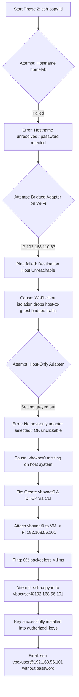

# Homelab Phase 2 — SSH Troubleshooting & Resolution

## 1. Core Goal
> Establish passwordless, key-based SSH access from the host machine (ThinkPad) to the guest Debian VM (`homelab`), enabling headless remote administration without relying on the VirtualBox GUI.

---

## 2. Journey & Failure Modes Encountered



---

## 3. Technical Breakdown of Each Obstacle & Fix

### Issue 1: Hostname Resolution & Wrong Target
- **Symptom:** Ran `ssh-copy-id user@homelab`. The ThinkPad asked for a password, which repeatedly failed even though the VM password was typed correctly.
- **Root Cause:**
  1. `user` is a literal placeholder, not the VM username.
  2. `homelab` was not registered in the ThinkPad's `/etc/hosts` or local DNS, causing connection attempts to point to localhost or resolve incorrectly.
- **Resolution:**
  - Check VM username: `whoami` (identified as `vboxuser`).
  - Use exact IP address rather than unresolved hostnames: `vboxuser@<IP>`.

---

### Issue 2: Bridged Adapter Packet Dropping Over Wi-Fi
- **Symptom:** Ran `ssh vboxuser@192.168.110.67`, command froze indefinitely.
- **Diagnosis via Host:**
  - `ping -c 2 192.168.110.67` returned `Destination Host Unreachable` (100% packet loss).
- **Root Cause:**
  - Wi-Fi adapters and wireless access points frequently enforce **Client Isolation** or block promiscuous MAC bridging, silently dropping traffic between the host laptop (`wlp3s0`) and bridged guest VMs.
- **Resolution:**
  - Switch network topology to **Host-Only Networking** (`vboxnet0`), which creates an isolated virtual network between host and VM completely independent of physical Wi-Fi or routers.

---

### Issue 3: Missing Host-Only Network Adapter in VirtualBox
- **Symptom:** In VirtualBox GUI Settings -> Network -> Host-Only Adapter, the `OK` button was greyed out with the warning: `"no host-only adapter selected"`.
- **Root Cause:**
  - VirtualBox on the host machine had no existing host-only interface defined (`vboxmanage list hostonlyifs` returned empty).
- **Resolution:**
  - Created interface via CLI on ThinkPad:
    ```bash
    vboxmanage hostonlyif create
    # Result: vboxnet0 created (IP: 192.168.56.1, Netmask: 255.255.255.0)
    ```
  - Verified VirtualBox DHCP server configuration on `192.168.56.100` with pool `192.168.56.101 - 192.168.56.254`.
  - Selected `vboxnet0` in VM Settings -> Network -> Host-Only Adapter.
  - VM booted and obtained IP: **`192.168.56.101`**.
  - Host ping test verified: **0% packet loss, 0.27ms latency**.

---

### Issue 4: Apparent Terminal Freeze on `ssh-copy-id`
- **Symptom:**
  Running `ssh-copy-id vboxuser@192.168.56.101` displayed:
  ```text
  /usr/bin/ssh-copy-id: INFO: Source of key(s) to be installed: ssh-add -L
  /usr/bin/ssh-copy-id: INFO: attempting to log in with the new key(s)...
  ```
  and appeared frozen.
- **Root Cause & Discovery:**
  - The script did not crash or hang on network failure. In fact, public key `id_ed25519.pub` had already been transferred and written into `/home/vboxuser/.ssh/authorized_keys` on the guest VM.
  - A batch-mode verification probe (`ssh -v -o BatchMode=yes vboxuser@192.168.56.101`) confirmed:
    ```text
    Server accepts key: /home/xriyann/.ssh/id_ed25519
    Authenticated to 192.168.56.101 using "publickey".
    Exit status 0
    ```
- **Resolution:**
  - The setup was already complete. Direct connection succeeded:
    ```bash
    ssh vboxuser@192.168.56.101
    ```
    Prompt changed immediately to: `vboxuser@homelab:~$`.

---

### Issue 5: Confusion on Diagnostic Probes & Welcome Banner
- **Symptom 1 (`BatchMode=yes` showing "Permission denied"):**
  - Running `ssh -v -o BatchMode=yes vboxuser@192.168.56.101` displayed key-offering attempts and ended with "Permission denied", yet plain `ssh` worked flawlessly.
  - **Explanation:** `-o BatchMode=yes` disables all interactive prompts (passphrases, keyboard input). If the running shell does not have the unlocked key loaded into `ssh-agent`, BatchMode aborts immediately by design rather than prompting. In normal interactive mode, SSH offers `id_ed25519`, the server finds it in `~/.ssh/authorized_keys`, and access is granted.
- **Symptom 2 ("Debian GNU/Linux comes with ABSOLUTELY NO WARRANTY"):**
  - On login, a disclaimer appeared stating Debian comes with no warranty.
  - **Explanation:** This is not an error—it is the standard Debian **MOTD (Message of the Day)** and GPL open-source software license notice displayed to every user upon successful login.

---

## 4. Key Rules & Invariants Learned

| Concept / Invariant | Explanation & Sysadmin Rule |
|---|---|
| **Interface Disparity** | Host interface (`wlp3s0`) and guest interface (`enp0s3`) do not need to match names. Network communication relies solely on IP routing and subnets. |
| **Wi-Fi Bridging Trap** | Bridged mode over Wi-Fi often fails due to wireless frame formats and router security policies. Use Host-Only or NAT + Port Forwarding when isolated from wired Ethernet. |
| **Host-Only Predictability** | Host-Only (`vboxnet0`) isolates the VM to the host computer (`192.168.56.0/24`), ensuring 100% offline reliability without interference from home Wi-Fi DHCP changes. |
| **State Prerequisite** | The VM guest must be powered **ON** to accept SSH connections or install keys; changes to virtual NIC settings in VirtualBox must be done while powered **OFF**. |
| **BatchMode vs Interactive** | `-o BatchMode=yes` suppresses all prompts and aborts if key is not pre-unlocked in agent, whereas standard `ssh` handles interactive key checks and passphrases normally. |
| **MOTD Banner** | "No warranty" text upon login is the standard legal Debian welcome banner (Message of the Day), not a system error or failure. |

---

## 5. Next Action Items (Phase 2 Hardening)
- [x] Host-only network configured (`vboxnet0` -> `192.168.56.101`).
- [x] SSH key pair exchanged and verified (`authorized_keys`).
- [x] Passwordless remote login functional (`ssh vboxuser@192.168.56.101`).
- [x] Edit `/etc/ssh/sshd_config` on VM:
  - `PermitRootLogin no`
  - `PasswordAuthentication no`
- [x] Restart SSH service: `sudo systemctl restart ssh`.
- [ ] Verify snapshot taken before moving to Phase 3 (Nginx).
